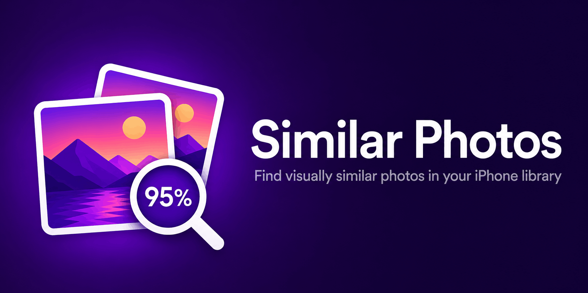

<p align="center">
  
</p>

<p align="center">
  Find visually similar photos in your iPhone library using Apple's Vision framework.<br>
  Paste an image from clipboard or pick from your library — the app searches your entire photo collection and shows the closest visual matches.
</p>

## Features

- **Indexed search** — builds a visual fingerprint of every photo once, then searches instantly
- **Three input sources** — pick from library, snap with camera, or paste from clipboard
- **Similarity scores** — each result shows a percentage match (green/orange/red)
- **Save to album** — save found photos to a "Similar Photos" album in your photo library, with visual badges showing which results are already saved
- **Quick actions** — long-press any result to copy to clipboard, favorite, save to album, or reject noise
- **Photo details** — tap a result to see the full image with date taken and GPS location
- **Reject noise** — remove bad matches and visually similar junk with one tap
- **Load more** — keep loading results beyond the initial 30
- **Shortcuts integration** — use "Find Similar Photos" as a Shortcuts action
- **100% on-device** — no data ever leaves your phone

## Install on iPhone

> **The unfortunate reality of iOS app distribution:** Apple does not allow free distribution of apps outside the App Store. Even "alternative" marketplaces like AltStore PAL (EU) require Apple notarization, which needs the $99/year Apple Developer Program. Sideloading tools like SideStore exist but require complex setup. The practical options for a free, open-source app are listed below.

### Option A: Build from Xcode (recommended)

The fastest and simplest path. Requires a Mac with Xcode (free).

1. Install [Xcode](https://apps.apple.com/app/xcode/id497799835) (free) from the Mac App Store
2. Clone this repo:
   ```
   git clone https://github.com/Rozkalns/SimilarPhotos.git
   ```
3. Open `SimilarPhotos.xcodeproj` in Xcode
4. Go to **Signing & Capabilities** → select your Apple ID as the team
5. Add **Privacy - Photo Library Usage Description** in the **Info** tab with value: `This app scans your photo library to find visually similar images.`
6. On your iPhone: **Settings → Privacy & Security → Developer Mode → enable** (requires restart)
7. Connect your iPhone via USB, select it as the build target
8. Press **Cmd+R** to build and run
9. On first run, trust the developer certificate: **Settings → General → VPN & Device Management → Trust**

**Note:** With a free Apple ID, the app expires after 7 days and needs to be reinstalled. If you have a friend with a Mac and Xcode, they can plug your phone in and reinstall in 30 seconds.

### Option B: AltStore Classic (worldwide — no Mac required after setup)

Uses [AltStore](https://altstore.io) or [SideStore](https://github.com/SideStore/SideStore) to sideload the pre-built IPA. Requires any computer (Mac/PC/Linux) for initial setup only.

1. Set up AltStore or SideStore on your iPhone ([AltStore install guide](https://faq.altstore.io/altstore-classic/how-to-install-altstore-macos), [AltStore getting started](https://faq.altstore.io/altstore-classic/your-altstore), [SideStore guide](https://docs.sidestore.io/docs/intro))
2. Download the IPA from [Releases](https://github.com/Rozkalns/SimilarPhotos/releases/latest)
3. Open the IPA with AltStore/SideStore to install
4. Grant photo library access when prompted

**Note:** Apps signed with a free Apple ID expire every 7 days. AltStore requires AltServer on a computer for weekly re-signing. SideStore handles re-signing on-device but has a more complex initial setup.

### Why not AltStore PAL / App Store / TestFlight?

All of these require enrollment in the [$99/year Apple Developer Program](https://developer.apple.com/programs/):

| Method | Requires $99/yr? | Why |
|--------|:-:|---|
| App Store | Yes | Apple review + paid developer account |
| TestFlight | Yes | Distributed through App Store Connect |
| AltStore PAL (EU) | Yes | Apps must be [notarized by Apple](https://faq.altstore.io/developers/distribute-with-altstore-pal) |
| AltStore Classic | **No** | Re-signs with user's own free Apple ID |
| Build from Xcode | **No** | Uses user's own free Apple ID |

## How It Works

1. **Indexing** — On first launch, the app loads a thumbnail of every photo and runs it through Apple's Vision neural network (`VNGenerateImageFeaturePrintRequest`), producing a 128-number fingerprint per image. These fingerprints are saved to disk (~20 MB for 25k photos).

2. **Searching** — When you pick or paste a query image, the app computes its fingerprint and compares it against all stored fingerprints using a distance function. Only the top-N closest matches are kept in memory. The comparison is pure math — no images are loaded — so it takes seconds, not minutes.

3. **Caching** — The index persists across app launches. Only new photos are processed on subsequent runs. If Apple updates the Vision model across iOS versions, the index rebuilds automatically.

## Requirements

- iPhone running iOS 17.0 or later
- Photo library access

## Privacy

Everything runs 100% on-device. No photos, fingerprints, or data leave your phone. There is no network access, no analytics, no tracking.
